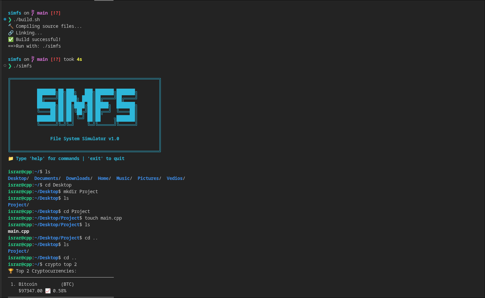

# simfs (v1.0)

<p align="center">
  <strong>Linux File System Simulator in C++</strong><br>
  <em>Tree data structures made tangible</em>
</p>

<p align="center">
  
  
  
  
</p>

---

## 🎯 What is simfs?

**simfs** is a Linux file system simulator built from scratch in C++. It started from a simple observation: Linux's hierarchical file system is essentially a tree data structure.

When you navigate `/home/user/docs/file.txt`, you're traversing a tree:

This project implements that tree structure practically, with real file operations and some API integrations as bonus features.
It gives a Terminal and you can use different basic linux cammands to interact with the system.

## ✨ Features

### 🗂️ Core File System
- Hierarchical tree-based file storage
- Complete file operations (CRUD, move, copy)
- Path resolution with absolute/relative paths
- Memory management with RAII principles


### 🛠️ Technical Highlights
- Modular C++ architecture
- libcurl for HTTP requests
- Custom JSON parsing
- Build automation
- Terminal UI with ANSI colors
- 
### 🌐 APIs Integrations 
- **Weather API** - Real-time weather 
- **Crypto API** - Live cryptocurrency prices
- **HTTP client** implementation using libcurl
- **Response caching** to reduce API calls

## 📸 Demo



### Project Structure
```bash
simfs/
├── include/     # Headers (interfaces)
├── src/         # Implementation
├── main.cpp     # Entry point
└── build.sh     # Build automation
```

### Try it Yourself 
### You can compile it using the bash script it built with it it is simple than longs cammands 
```bash
# Clone and build
git clone https://github.com/israrkhan-cys/simfs.git
cd simfs
./build.sh

# Run
./linux_sim
```
### If u have any suggestion or feedbacks for this project hit me up on linkden

<div align="center">
⭐ If you find this project useful, please give it a star!

*Built with ❤️ by Israr*
</div>
